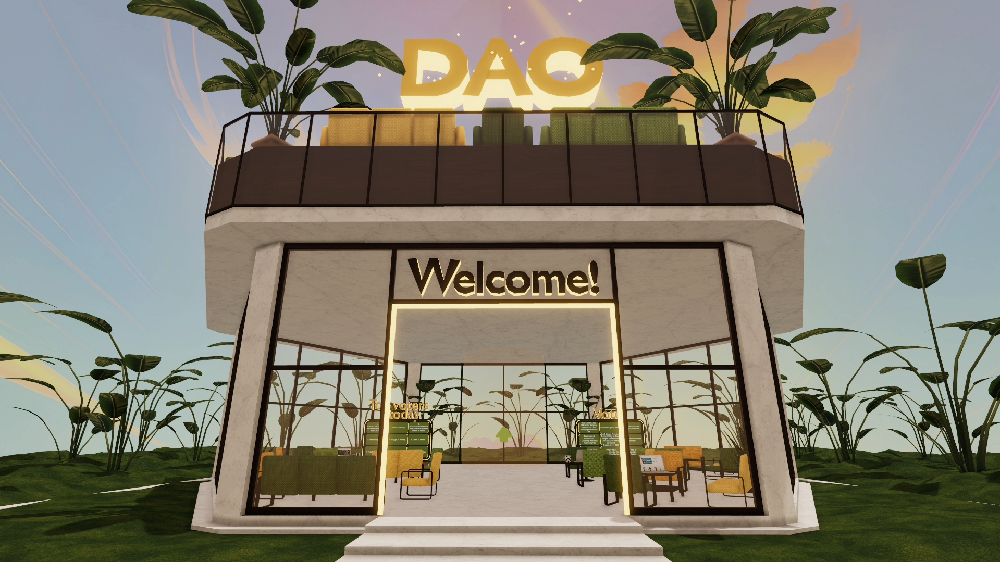
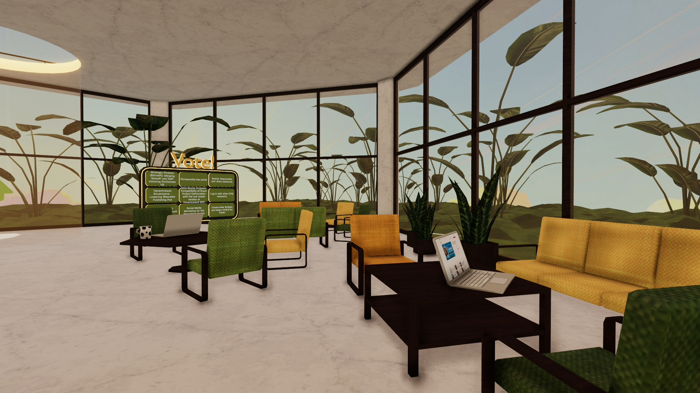
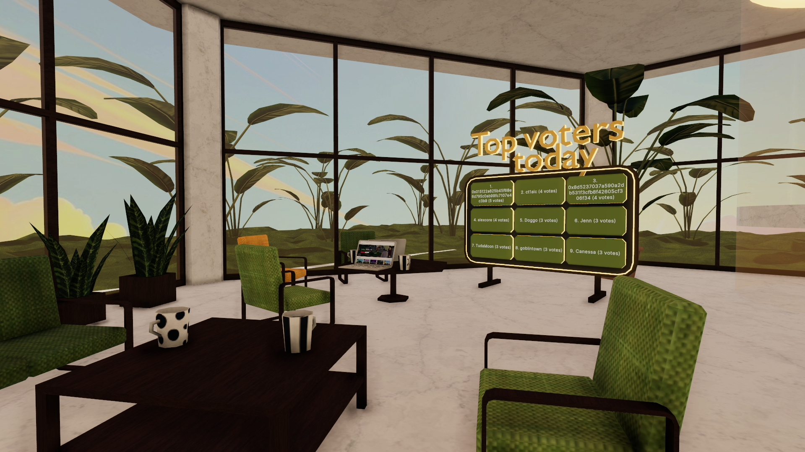
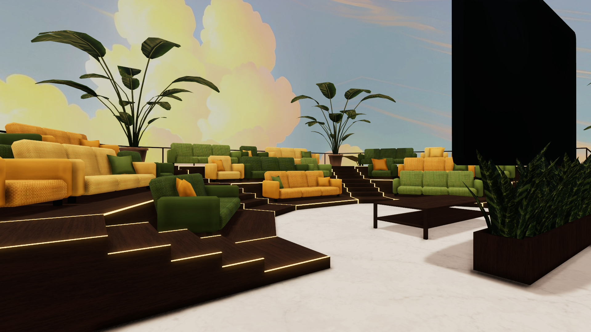
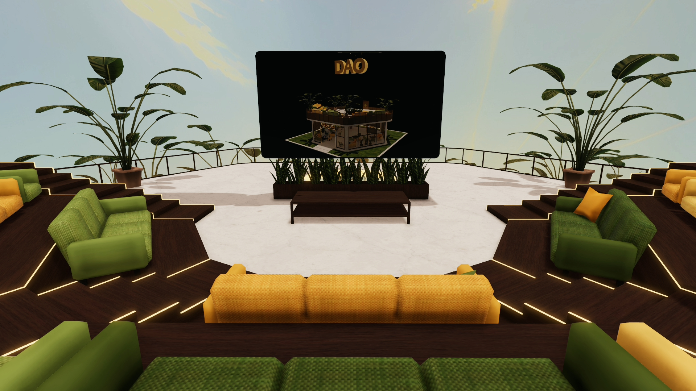
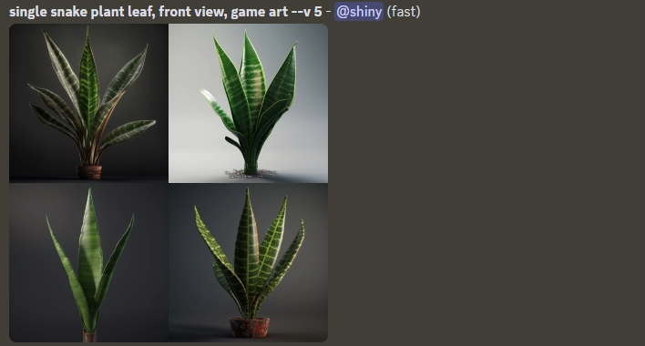
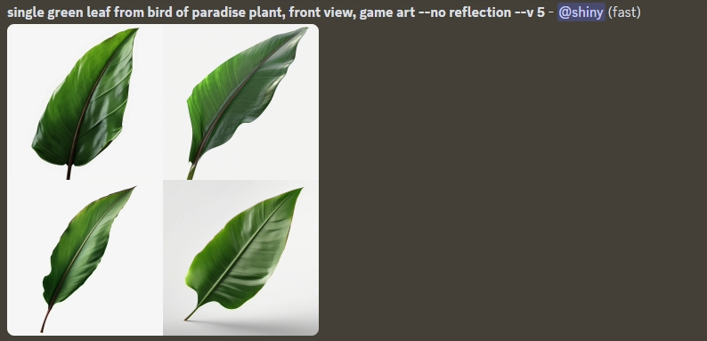
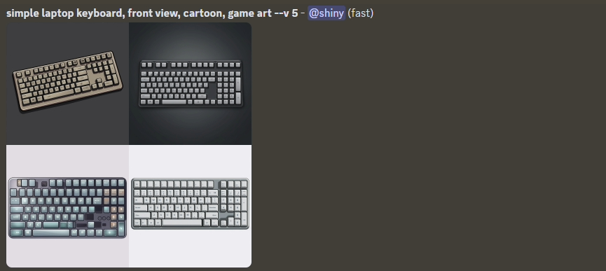
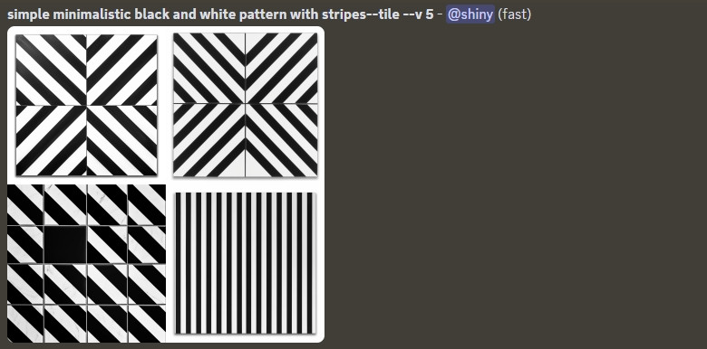

# Decentraland scene

This project contains scene with Decentraland DAO headquarters created for Sandstorm's Decentraland contest #18.
Currently deployed under Decentraland name `Improve`. Follow [this link](https://play.decentraland.org/?realm=improve.dcl.eth) or type in the Decentraland chatbox `/changerealm improve.dcl.eth` to visit the scene. This scene is built with the SDK7.

## 3D models

Textures used for 3D models:

- Grass on the ground [ambientCG](https://ambientcg.com/view?id=Moss004), AmbientCG has a nice selection of textures under [Creative Commons CC0 1.0 Universal License](https://docs.ambientcg.com/books/website-licensing/page/license-information)
- Marble for building [ambientCG](https://ambientcg.com/view?id=Marble004)
- Wood [ambientCG](https://ambientcg.com/view?id=Wood027)
- Fabric for chairs and sofas [ambientCG](https://ambientcg.com/view?id=Fabric035)
- Plant leaves, patterns on mugs and laptop keyboard generated using Midjourney.
  - Small plant (snake plant) leaves - top left image
    
  - Big plant (bird of paradise) leaves - bottom right image
    
  - Laptop keyboard - bottom right image
    
  - Dot pattern on mugs - bottom right image
    
  - Stripe pattern on mugs - bottom right image
    
  - Geometric pattern on mugs - bottom left image
    

## Copyright info

This scene is protected with a standard Apache 2 licence. See the terms and conditions in the [LICENSE](/LICENSE) file.
